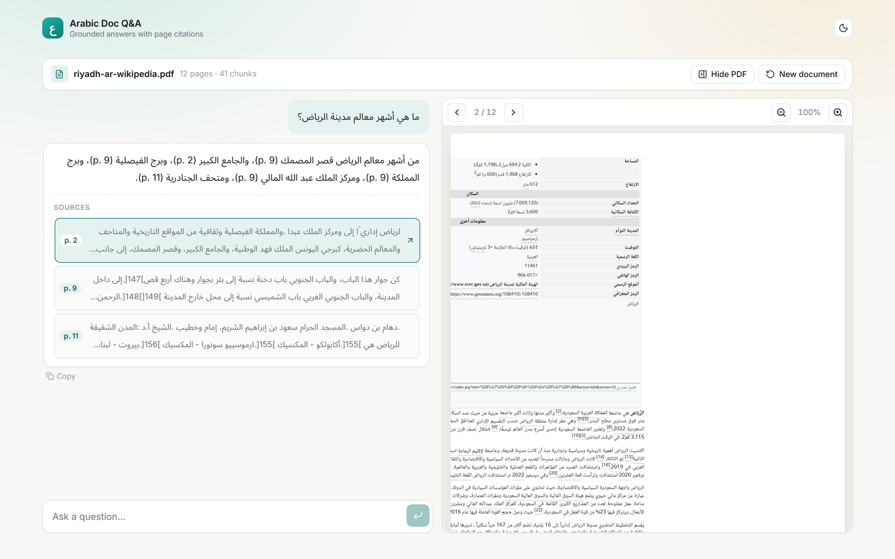
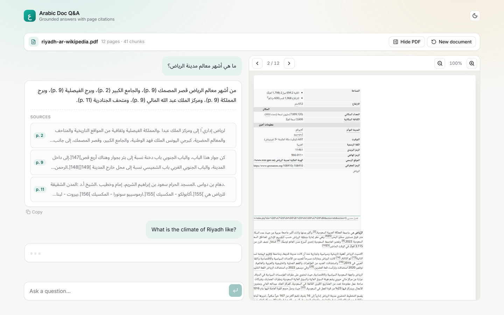
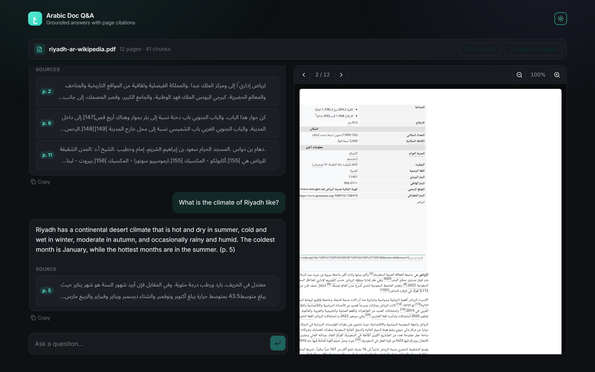
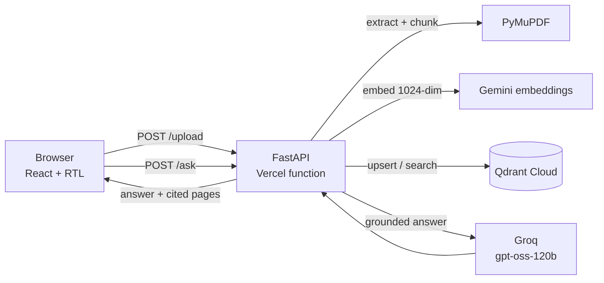

# arabic-doc-qa

Ask questions about a PDF in Arabic or English, and get answers with page citations.

**[Try it →](https://arabic-doc-qa.vercel.app)** · [API docs](https://arabic-doc-qa-api.vercel.app/docs)



## What it does

- Upload a PDF — Arabic or English.
- Ask a question in either language.
- Get an answer grounded in the document, with the pages it came from — and click a
  citation to open that page beside the answer.

An Arabic question, an Arabic answer citing pages 2, 9 and 11, and the cited page
opened alongside it. The infobox visible on the right is also the source of the one
question the evaluation cannot grade cleanly — it states the city's elevation twice,
as `612 متر` and as `1,968 قدم (600 م)`.

### An English question against the same Arabic document



The answer only exists in the document as Arabic. Retrieval crosses the language
boundary; the answer comes back in the language it was asked in.

<details>
<summary>Upload screen and dark theme</summary>




</details>

Screenshots are generated by driving the deployed app in a real browser:
`node docs/screenshots.mjs`.

## Why

Most document-Q&A demos are English-only, and Arabic shows up as an afterthought that
happens to fall out of a multilingual model. This project treats Arabic as a first-class
language instead: text normalization, multilingual embeddings, and an RTL interface.

It is for teams whose paperwork is Arabic — contracts, policies, government forms — who
need an answer they can trace back to a page, not a plausible-sounding paragraph.

## How it works

```
PDF ──► extract ──► chunk ──► embed ──► Qdrant
        PyMuPDF     ≤1000 chars    gemini-embedding-001
        reading     never crossing  1024-dim
        order       a page boundary

question ──► embed ──► search top 5 ──► Groq ──► answer + citations
                       filtered by       grounded to the retrieved
                       document_id       chunks only
```

Three decisions carry most of the weight:

**Extraction preserves reading order.** PyMuPDF's `sort=True` orders text geometrically,
which reverses Arabic word order — a heading reading `طلب حجز وجبات` comes back as
`وجبات حجز طلب`. Content-stream order is the logical reading order for both scripts.

**Chunks never cross a page boundary**, so every chunk has exactly one page to cite. A
sentence straddling a page break gets split; exact citations are worth more.

**Citations are filtered to the pages the model actually cited** inline, intersected with
what it was shown, so an invented page number cannot produce a citation.

## Architecture



The API holds no state. Everything persistent lives in Qdrant, which is what lets
the backend run as a serverless function that starts fresh on every request.

## Limitations

**Scanned PDFs are out of scope.** They carry no text layer and need OCR. The app detects
them and says so rather than returning an empty answer. This is not a corner case — the
first real Arabic PDF tested against it was 271 photographed pages.

**Documents are capped at 20 pages,** because ingestion is synchronous. Async ingestion
for longer documents is a v2 item.

**Embeddings run through an API rather than a local model.** `multilingual-e5-base`
under sentence-transformers needed ~800 MB resident, and the smallest multilingual model
available under ONNX still needed ~700 MB once its runtime had allocated its arena —
above every free tier available. Moving to an API took the service to 132 MB and cut
ingestion of a 12-page PDF from 29s to 4s. Running the model in-process is a v2 item, for
when the deployment budget allows it. Two providers are supported — Gemini and Jina,
both free and both 1024-dim — selected with `EMBEDDING_PROVIDER`, so running out of
quota on one is a config change rather than a rewrite.

**Some PDFs damage their own text.** One government document tested against this maps the
lam-alef ligature to a single wrong character, so `سلامة` extracts as `سامة`. That is a
defect in the file's embedded font, not something extraction can repair.

## Stack

Python 3.11 · FastAPI · PyMuPDF · Gemini embeddings (`gemini-embedding-001`) · Qdrant · Groq (`openai/gpt-oss-120b`) · Vite + React + TypeScript

## Run locally

Backend:

```bash
cp .env.example .env          # fill in GROQ_API_KEY, JINA_API_KEY, QDRANT_URL, QDRANT_API_KEY
pip install -e "backend[dev]"
make dev                      # http://127.0.0.1:8000/health
```

Front end, in a second terminal:

```bash
cd frontend && npm install
make web                      # http://localhost:5173
```

`make test` runs the tests, `make lint` runs ruff, `make build-web` builds the front end.

## Deployment

Two Vercel projects from this one repo, distinguished only by root directory:

| Project | Root directory | Serves |
| --- | --- | --- |
| `arabic-doc-qa` | `frontend` | the React app |
| `arabic-doc-qa-api` | `backend` | FastAPI, as a serverless function |

Setting the root directory on each project is required. Without it a git-triggered build
runs from the repo root and fails — the front end looks for `vite` where there is no
`node_modules`.

Pushing to `main` deploys both. Because each project sets a root directory, the CLI
cannot deploy from inside a subdirectory — it would upload that directory as the
root and Vercel would then look for `backend/backend`.

`backend/Dockerfile` also builds a working container, for any host that takes one.

## Evaluation

Ten questions against an Arabic Wikipedia article on Riyadh — five Arabic, five
English. The English ones are cross-lingual by construction: the answer only
exists in Arabic text. Two questions have no answer in the document at all, to
check the model declines rather than invents.

Reproducible: `python evaluation/run_eval.py --api https://arabic-doc-qa-api.vercel.app`.
Questions and grading live in [`evaluation/`](evaluation/), full output in
[`evaluation/results.md`](evaluation/results.md).

A question passes only if all three hold — the answer contains the expected
fact, **cites the page that fact is on**, and is written in the language it was
asked in. Grading citations separately is the point: a right answer pointing at
the wrong page is a failure, because the citation is the product.

| Model | Score | Failures |
| --- | --- | --- |
| `openai/gpt-oss-120b` | **10 / 10** | — |
| `qwen/qwen3.8-27b` | 8 / 10 | two correct answers citing the wrong page |

### What the evaluation changed

**It picked the model.** Qwen was chosen on a three-question spot check earlier
and looked fine. Across ten questions it attributed correct facts to the wrong
retrieved page twice — invisible unless citations are graded separately from
answers.

**It found a bug.** An Arabic question with no answer in the document was
declined in English. The rule to answer in the question's language was already
in the prompt; the model read it as applying to answers and treated declining as
something else. Fixed by detecting the question's script in code and naming the
required language in the request, rather than relying on a general instruction.

**It found a bug in itself.** The first grader passed that case, because it only
checked that a refusal happened. Answer language is now graded independently.
A second grader gap followed: `لا يمكنني` was missing from the refusal
phrase list, so a valid Arabic refusal scored as a failure.

**It corrected a false conclusion.** English questions appeared 8× slower than
Arabic. They were also always asked last. Re-running with English first made
English fast and Arabic slow — it is Groq's free-tier rate limiting and client
backoff under burst, not language. Median response is ~2s, with a tail to ~15s
once several requests land together.

### Known weaknesses

`ar-4` asks Riyadh's elevation. The infobox states both `612 متر` and
`1,968 قدم (600 م)`, and infoboxes extract as jumbled key-value text, so the
model can return either figure defensibly. Numeric facts from tables and
infoboxes are the least reliable part of this pipeline — prose is handled well,
layout is not.

## License

MIT — see [LICENSE](LICENSE).
